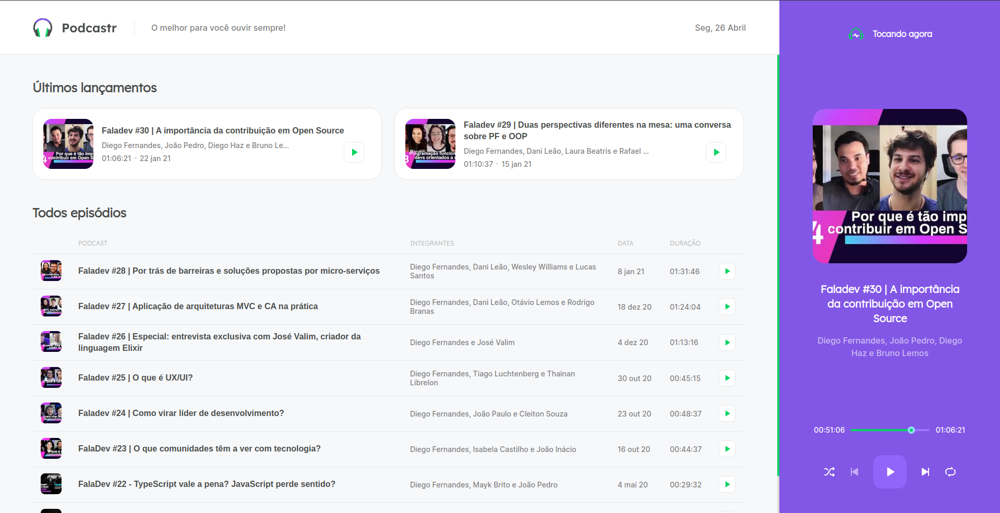
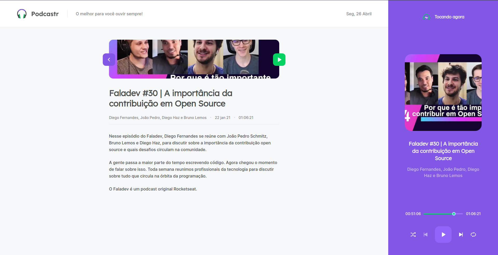
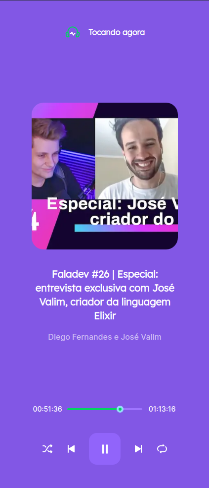
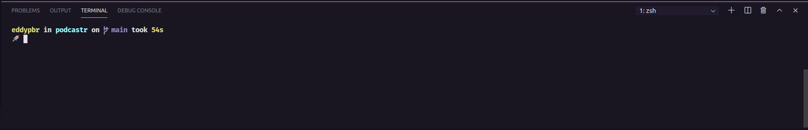

 
 
<h1 align="center">
        
    NextJS | ReactJS | Typescript
</h1>

  
  
  
    

 

 
 

## :bookmark: Resumo
 

O projeto consiste na elaboração de um sistema de podcasts, os podcasts deste projeto já estão hospedados pela
rocketseat, então foi gerado um JSON que simule o resultado de uma requição para uma API, a mesma retorna os dados
do podcast, tais como: duração, thumbnail, participantes e afins. 

Então o projeto exibe uma lista com os podcasts gravados, e possui um player para tocar os podcasts,
além disso cada podcast tem uma página própria do seu episódio, porém, não necessariamente essa página
tem de ser acessada para escutar o mesmo, o que eu quero dizer é que na propria página home o usuário 
pode ouvir os podcasts.

Para melhor entendimento, você pode ver o tópico seguinte com as interfaces.

 

## :sparkles: Next Level Week #04
 

O Next Level Week foi originada pela [@Rocketseat](https://rocketseat.com.br/), sendo um evento online e totalmente gratuito que vai ajudar as pessoas 
a dar o próximo passo na evolução como dev. O NLW é uma semana prática com muito código, desafios e networking.

Este projeto em específico faz parte da trilha de REACT ministrada por [@DiegoFernandes](https://github.com/diego3g), e sinceramente meus agradecimentos a 
toda a equipe da [@Rocketseat](https://rocketseat.com.br/) por passar todo esse conhecimento gratuítamente para todos, e recomendo a você DEV leitor
que deem uma olhada no material dos cursos deles, todos são realmente excelentes!

Continuando, a interface foi elaborada por [Tiago Luchtenberg](https://www.instagram.com/tiagoluchtenberg/) 
utilizando a plataforma FIGMA porém não possuo o link do projeto. De toda forma, segue os prints da interface.
 
 
 
 

   
   
   
   
  
   
   
   
  
   
   
   

## :computer: Tenologias Utilizadas
 

Este projeto não é nada muito complexo, dentre as tecnologias utilizadas estão:
 

- [Typescript](https://www.typescriptlang.org/)
- [ReactJS](https://pt-br.reactjs.org/)
- [NextJS](https://nextjs.org/)
- [ReactIcons](https://react-icons.github.io/react-icons/)
- [Figma](https://www.figma.com/)

 

## :wrench: Colocando o projeto para rodar
 

Para colocar o projeto para rodar siga o passo-a-passo a seguir:

- Primeiramente acesse com dois terminais diferentes o diretório raiz do projeto;
- No terminal 1 execute o comando: `yarn` e aguarde;
- Ainda no terminal 1 execute o comando `yarn server`;
- No terminal 2 exeucte o comando `yarn dev`;
- Agora acesse `http://localhost:3000/`;
 

  

 

## :memo: License

Este projeto esta sob a [MIT license](LICENSE) para mais detalhes.
 
 

## :wave: Social

Siga EddyPBR nas redes :wink:
 

- [Instagram](https://www.instagram.com/edvaldo_junior_dev/)
- [LinkedIn](https://www.linkedin.com/in/edvaldojuniordev/)

 

Siga a #Rocketeat nas redes
 

- [website](https://rocketseat.com.br/)
- [YouTube](https://www.youtube.com/channel/UCSfwM5u0Kce6Cce8_S72olg)
- [Instagram](https://www.instagram.com/rocketseat_oficial/?hl=pt-br)
